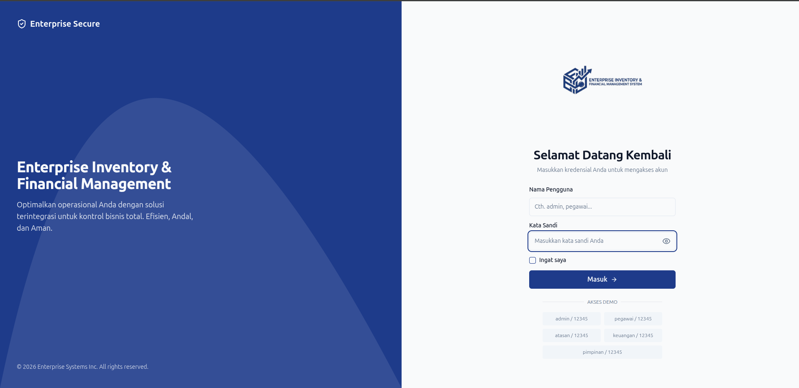
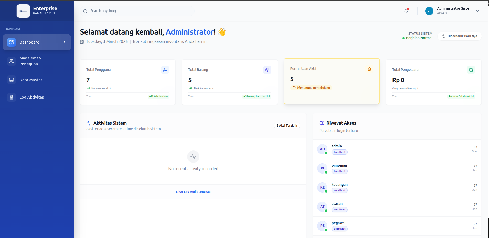
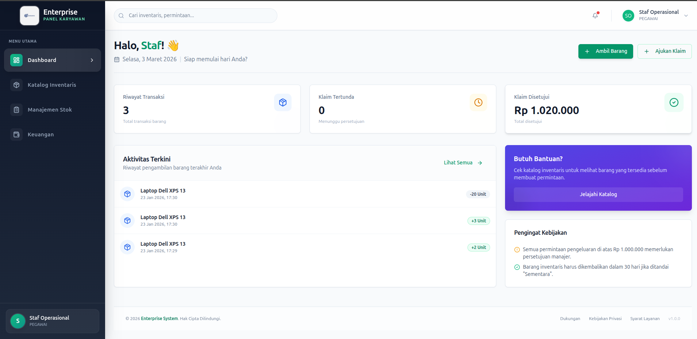
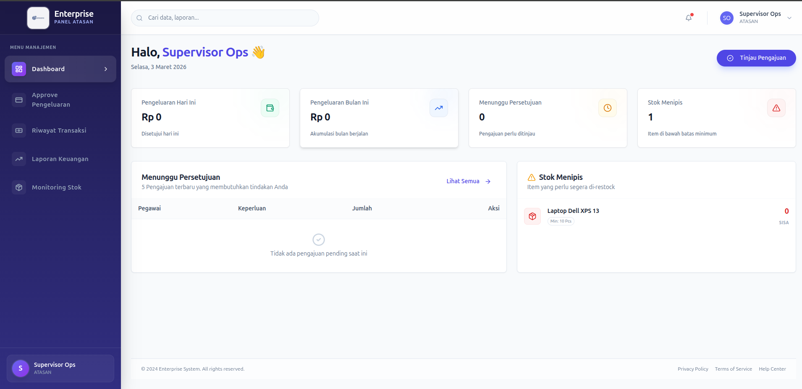
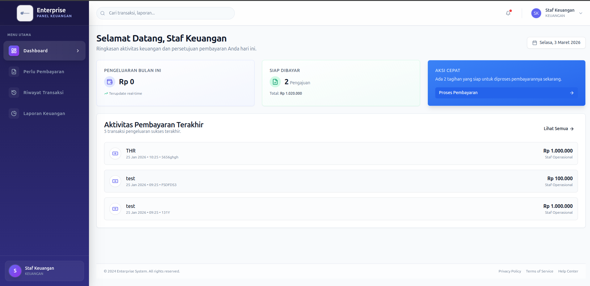
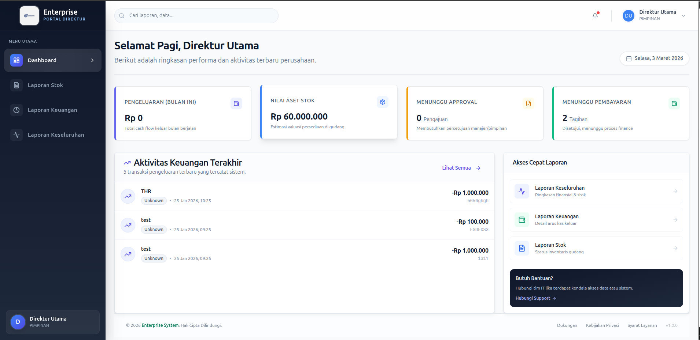

# Enterprise Inventory & Financial Management System

## 📖 Description

Sistem manajemen inventaris dan keuangan perusahaan yang komprehensif, dirancang untuk mengelola stok, pengajuan pengeluaran, dan pelaporan keuangan dengan pendekatan berbasis role (Role-Based Access Control). Aplikasi ini mengintegrasikan alur operasional dari mulai permintaan barang, persetujuan atasan, hingga pencairan dana oleh bagian keuangan dan di akhir dipantau oleh pimpinan (director).

## ✨ Features

Sistem ini mendukung 5 role pengguna dengan fungsionalitas dan hak akses spesifik:

### 1. Admin

- Manajemen Pengguna komprehensif (Tambah, Ubah, Nonaktifkan, Reset Password).
- Pengaturan Data Master dan Hak Akses (Kategori, Satuan Produk, Divisi Perusahaan).
- Konfigurasi Alur Persetujuan & Monitoring Log Aktivitas Sistem.

### 2. Pegawai (Staff)

- Kelola Data Barang (CRUD).
- Pencatatan Stok Masuk & Keluar.
- Pembuatan Pengajuan Pengeluaran Dana Perusahaan.

### 3. Atasan (Manager)

- Proses Workflow Persetujuan/Penolakan Pengajuan Pengeluaran.
- Monitoring Status Stok & Laporan Ringkas per Divisi.

### 4. Keuangan (Finance)

- Proses Pembayaran untuk Pengajuan yang Disetujui Atasan.
- Pencatatan Transaksi ke Buku Kas Perusahaan.
- Pembuatan dan Export Laporan Keuangan (Harian, Bulanan, Per Divisi).

### 5. Pimpinan (Director)

- Akses Real-time ke Laporan Eksekutif.
- Dashboard Visual interaktif untuk Stok, Pengeluaran, dan Grafik Ringkasan Kesehatan Perusahaan.

## �️ Tech Stack

**Frontend**

- **Framework**: React (TypeScript) via Vite
- **Styling UI**: Tailwind CSS, shadcn/ui
- **Data Visualization**: Recharts, Lucide React (Icons)
- **State/Routing**: React Router DOM, Zustand (Authentication State)

**Backend**

- **Framework**: Java Spring Boot 3+
- **Database ORM**: Hibernate / Spring Data JPA
- **Security**: Spring Security dengan autentikasi berbasis JWT (JSON Web Token)
- **Database Engine**: PostgreSQL

## ⚙️ Installation

### Prasyarat

- Node.js (v18+) & NPM / Yarn
- Java JDK 17+ & Maven
- PostgreSQL Server (Buat database kosong bernama: `db_inventory`)

### 1. Backend Setup

1. Buka konfigurasi database di `backend/src/main/resources/application.properties`.
2. Sesuaikan username dan password PostgreSQL Anda.
3. Jalankan server backend menggunakan Maven Wrapper:
   ```bash
   cd backend
   ./mvnw clean install
   ./mvnw spring-boot:run
   ```
4. Server REST API akan berjalan di `http://localhost:8080`.

### 2. Frontend Setup

1. Masuk ke direktori frontend dan install semua dependencies:
   ```bash
   cd frontend
   npm install
   ```
2. Jalankan aplikasi frontend di mode pengembangan:
   ```bash
   npm run dev
   ```
3. Web App dapat diakses melalui browser di `http://localhost:5173`.

## � Environment Variables

### Backend (`application.properties`)

Pastikan variabel lingkungan koneksi database telah diset.

```properties
spring.datasource.url=jdbc:postgresql://localhost:5432/db_inventory
spring.datasource.username=postgres
spring.datasource.password=rahasia
spring.jpa.hibernate.ddl-auto=update
jwt.secret=YOUR_SUPER_SECRET_KEY_FOR_JWT_GENERATION
```

### Frontend (`.env`)

Buat file `.env` di direktori `frontend` untuk menyesuaikan endpoint API (contoh):

```env
VITE_API_BASE_URL=http://localhost:8080/api
```

## 📚 API Documentation

Endpoint dikelompokkan berdasarkan role dan fitur fungsional. Dokumentasi lengkap dapat dilihat melalui Swagger/OpenAPI (apabila dikonfigurasi) di path `/swagger-ui.html`.

**Struktur routing dasar API:**

- `POST /api/auth/login` - Men-generate token JWT.
- `GET/POST /api/admin/*` - Endpoint untuk manajemen user dan konfigurasi.
- `GET/POST /api/inventory/*` - Endpoint CRUD item inventaris.
- `GET/POST /api/finance/*` - Manajemen transaksi dan pengajuan kas.
- `GET /api/director/*` - Aggregasi laporan keseluruhan untuk Pimpinan.

## 📸 Preview/Screenshots

- **Halaman Login & Autentikasi**  
  

- **Dashboard Pegawai (Staff)**  
  

- **Dashboard Admin/Staf**  
  

- **Dashboard Atasan (Manager)**  
  

- **Dashboard Keuangan (Finance)**  
  

- **Dashboard Direktur Utama (Pimpinan)**  
  

## ✍️ Author

**Azarya Geraldo**  
_Enterprise Inventory & Financial Management System Project_

## 📄 License

Distributed under the MIT License. See `LICENSE` for more information.
